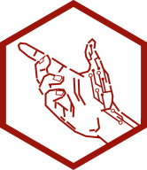

<!-- README.md is generated from README.Rmd. Please edit that file -->

```{r, include = FALSE}
 knitr::opts_chunk$set(
   collapse = TRUE,
   comment = "#>",
   fig.path = "man/figures/README-",
   out.width = "100%",
   eval = FALSE
 )
```

# agesofman 

<!-- badges: start -->

<!-- badges: end -->

## Introduction

The *Ages of Man* project applies advanced statistical methodology on remote sensing agriculture. It is composed of several R packages, as well as other elements, each one focusing on a different application.

  -   *cronus* is an R package that focuses on database creation. It can be used to download and process agricultural, environmental and satellite data from various sources.
  -   *persephone* is an R package that deals with applications in crop development.
  -   *hermes* is an R project that stores files. It includes executable R scripts, shiny applications, rmd reports, plots and more.
  -   *Demeter* is the database created by *cronus* and used by the *prometheus* project team members in their research studies.
  -   *Athena* is a Mendeley collection of research papers available to the *prometheus* project team members.

## Installation

You can install the development version of *agesofman* from github by running the following line of code: 

```{r, eval = FALSE}
 devtools::install_github("agesofman/agesofman")
```

All packages of the *Ages of Man* will be automatically installed. Although not necessary, it is strongly recommended to download *hermes*, which contains many executable examples, that can help users get familiar with the project. *hermes* can be downloaded to a specified directory by using the `download_hermes()` function.

```{r, eval = FALSE}
 library(agesofman)
 download_hermes(dir = getwd())
```

More details on *hermes* can be found in https://github.com/agesofman/hermes .

## Documentation

Detailed documentation, along with reproducible examples, can be found in the package vignettes.

```{r}
vignette(topic = "hermes", package = "agesofman")
```

## Team

The *Ages of Man* project is developed in the 
[Mathematics Department](https://en.math.uoa.gr/ "Mathematics Department Homepage") of the [University of Athens](https://en.uoa.gr/ "University of Athens Homepage"). The project maintainer is [Ioannis Oikonomidis](http://users.uoa.gr/~goikon/ "Ioannis Oikonomidis Homepage"), working under the supervision of Prof. Samis Trevezas.

